# 🏋️ Proyecto Final — EDA, ETL y Dashboard de un Gimnasio con Virtuagym

## 📖 Descripción del Proyecto

Este proyecto corresponde al Proyecto Final del programa de análisis de datos.

En este proyecto se aplican y desarrollan los conocimientos adquiridos a lo largo del programa.

El proyecto se centra en el desarrollo completo de un caso real de analítica de negocio aplicado a un gimnasio.

* Transformación y limpieza profunda de los datos.
* Análisis descriptivo de los datos.
* Análisis estadístico de los datos.
* Visualización de los datos.
* Dashboard operativo.
* Informe explicativo del análisis.

A lo largo del proyecto se desarrollan procesos de:

* extracción de datos,
* transformación y limpieza,
* análisis exploratorio (EDA),
* análisis estadístico,
* visualización de datos,
* construcción de dashboard operativo.

# 🎯 Objetivo del Proyecto

En un negocio de gimnasio es fundamental entender los datos históricos (analítica descriptiva) de clientes, altas y bajas y visitas al gimnasio.

El proyecto tiene como objetivo desarrollar una solución completa de análisis de datos que permita comprender el comportamiento histórico de clientes y actividad operativa del gimnasio.

## Clientes

* Evolución temporal.
* Caracterización de clientes.
* Tipología de cuotas.
* Segmentación.

## Altas y bajas

* Evolución temporal.
* Caracterización.
* Análisis de retención.
* Comportamiento de abandono.

## Visitas al gimnasio

* Ratios de visitas por día y horario.
* Frecuencia de asistencia.
* Caracterización según tipo de cliente.
* Concurrencia y ocupación.

# 🛠️ Herramientas Utilizadas

## ETL y análisis de datos

* Python
* Pandas
* Requests
* python-dotenv
* Visual Studio Code

## Dashboard y visualización

* Power BI

# 🗂️ 1.1 EDA. Comprensión general de los datos. Carga de los datos.

Los datos se encuentran un CRM, “Virtuagym”.

Se solicita el acceso API al soporte de CRM, y este envía la documentación.

Es una API que requiere dos credenciales, “club\_secret”, y “api\_key”. Se obtienen.

En la documentación de la API, se identifican los siguientes Datasets de entre todos los disponibles, que tienen la información relevante:

| Dataset | Descripción |
| --- | --- |
| Club Members | Clientes del gimnasio |
| Club Employees | Empleados del gimnasio |
| Membership Definition | Definición de membresías |
| Membership Instances | Instancias de membresías |
| Club Visits | Registros de acceso y visitas |

# ⚙️ Arquitectura ETL

La extracción de datos se realiza mediante peticiones HTTP utilizando la librería requests.

El acceso y descarga de los datos se realiza con Python utilizando la librería requests, mientras que la transformación y limpieza se desarrolla con pandas y estructuras DataFrame.

Cada dataset dispone de endpoints, métodos, parámetros y sistemas de paginación específicos. Además, el API posee limitaciones de consultas máximas por hora y por día.

## Gestión del API

Se implementó un objeto encargado de:

* controlar límites de peticiones,
* gestionar solicitudes,
* manejar paginación,
* centralizar autenticación.

## Conversión a DataFrames

Se desarrolló un segundo objeto para:

* descargar datasets,
* convertir respuestas JSON en DataFrames,
* automatizar procesos de carga.

# 🔄 Actualización de Datos

Se implementan dos tipos de actualización de datos:

* carga completa (full refresh)
* carga incremental (incremental refresh)

según las capacidades del API.

Todos los datasets permiten actualización incremental excepto:

* Membership Instances

ya que no dispone de campo timestamp.

Para soportar ambos sistemas se crean metadatos asociados a cada dataset:

* tipo de actualización,
* timestamp de última sincronización,
* cursor de paginación.

El almacenanamiento de las actualizaciones de cada Dataset se realiza en dos ficheros:

* uno general, que almacena los metadatos del Dataset en cabecera (#), y después una línea por cada dato, anadiéndose para cada dato si se recopiló por un backup full o incremental, así como el timestamp del api al actualizarse. Este general permite trazar todo el proceso de acceso y actualización en el API e incluso permitiría trazar variaciones históricas en algunos datos.
* un snapshot, que es sólo la versión de los datos más reciente, para después ser analizado y transformado.

El proceso de acceso y descarga termina generando 5 dataframes, que son los snapshots de los Datasets:

* df\_members (Club Members)
* df\_employees (Club Employees)
* df\_memberships\_definition (Membership Definition)
* df\_memberships (Membership Instances)
* df\_visits (Club Visits)

# 📊 1.2 EDA: Comprensión general de los datos. Vista rápida. Tipos de datos. Estadística descriptiva. Resumen estadístico.

En esta fase del proyecto consiste en comprender la estructura y calidad de los datos.

## Técnicas utilizadas

* Carga inicial de datos.
* Revisión de tipos de datos.
* Estadística descriptiva.
* Resumen estadístico.
* Identificación de valores nulos.

## Métodos principales de pandas

# Primeras filas
df.head()

# Información del dataset
df.info()

# Estadísticos descriptivos
df.describe()

Procedemos con los todos los datasets.

## CLUB MEMBERS

Se compone de los siguientes campos, según el API:

| Field | Type | Optional | Values | Information |
| --- | --- | --- | --- | --- |
| member\_id | int | no |  | The ID for the member |
| club\_id | int | no |  | The ID of the club |
| club\_member\_id | string | yes |  | Custom ID from external system |
| external\_id | string | yes |  | External member ID |
| firstname | string | no |  | First name |
| lastname | string | no |  | Last name |
| email | string | no |  | Email address |
| active | boolean | no |  | Active/inactive |
| is\_pro | boolean | no |  | Pro member |
| gender | string | yes | m/f | Gender |
| member\_since | int | no |  | Timestamp account creation |
| timestamp\_edit | int | no |  | Timestamp modification |
| birthday | string | yes |  | Birthday |
| lang | string | yes |  | Language |
| zip | string | yes |  | Zip code |
| street | string | yes |  | Street |
| street\_extra | string | yes |  | Extra address info |
| place | string | yes |  | City |
| country | string | yes |  | Country |
| formatted\_address | string | yes |  | Formatted address |
| phone | string | yes |  | Phone |
| mobile | string | yes |  | Mobile |
| rfid\_tag | string | yes |  | RFID tag |
| early\_booking\_access | boolean | yes |  | Early booking access |

Se realiza una vista general con df.head(), df.info(), df.describe().

Las conclusiones son:

* Hay varios campos que no aportan ninguna información porque tienen el mismo valor (country, lang, early\_access).
* Las columnas son iguales a las de la API salvo que external\_id es igual a orginal\_member\_id.
* Los tipos de datos en la API string en el dataframe aparecen como object.

Será necesario en fases posteriores:

1. fijar el índice al member\_id,
2. eliminar campos por protección de datos (firstname, lastname, email, phone, mobile),
3. eliminar campos no relevantes (club\_id, external\_id, is\_pro, lang, country, rfid\_tag, early\_booking\_access, user\_id, formatted\_address),
4. convertir datos a string,
5. convertir datos a fechas (date y datetime).

# 📊 2. EDA: Transformación y limpieza

En esta etapa, se preparan y mejoran los datos para que sean más fáciles de analizar.

La transformación y limpieza incluyen:

* detección y corrección de errores,
* normalización,
* estandarización,
* transformación de datos.

## Técnicas

* Eliminación de datos protegidos por RGPD y datos irrelevantes para el análisis.
* Corrección de tipos de datos.
* Eliminación de datos duplicados.
* Manejo de valores nulos.
* Normalización y estandarización.
* Transformaciones logarítmicas o de potencias.

## CLUB MEMBERS

Las tareas de transformación y limpieza son:

* fijar el índice al “member\_id” que es la id único de los clientes
* eliminar campos por protección de datos (firstname, lastname, email, mobile, phone)
* eliminar campos no relevantes (club\_id, external\_id, is\_pro, active, lang, country, rfid\_tag, early\_booking\_access, user\_id, formatted\_address)
* se convierte a tipo date las fechas (birthday está como string, membership\_since y timestamp\_edit están en milisegundos)
* timestamp\_edit (tiempo en que se actualiza el registro), se elimina pero se crean dos campos, uno con timestamp\_edit\_date, y otro como datetime (timestamp\_edit\_datetime): timestamp\_edit\_date si es igual contract\_end\_date se trata de un baja, y timestamp\_edit\_datetime su valor máximo determina la fecha y hora de la última modificación
* se eliminan los empleados de la tabla de miembros
* se eliminan los miembros que no tienen una membresía asociada (clientes no activos cuando se hizo la carga inicial del CRM en el año 2023)

## MEMBERSHIP DEFINITION

Las tareas de transformación y limpieza son:

* se fija el índice a membership\_id
* se eliminan todos los campos salvo membership\_id, membership\_name, membership\_price

Al mantenerse sólo el membership\_price los ingresos calculados como suma de membership\_price indicarán la “base de ingresos” proforma, pero no la facturación real ya que esa implicaría hacer prórrata de la cuota y sumar también la matrícula.

La facturación no es el objetivo del análisis.

* se cambia el tipo de datos de datos membership\_name (tipo object) a string y el tipo de membership\_price de tipo int a tipo float

## MEMBERSHIP INSTANCES

Las tareas de transformación y limpieza son:

* fijar el índice a instance\_id
* los clientes sólo tienen una membresía al mismo tiempo (el gimnasio es mono producto), pero las membresías han cambiado durante el tiempo; por ello, se elige para cada cliente únicamente la membresía contract\_end\_date más reciente
* se seleccionan únicamente las columnas relevantes para el análisis: member\_id, membership\_id, contract\_end\_date
* se convierte el tipo de datos contract\_end\_date de tipo string a tipo date
* se indexa por member\_id

## CLUB VISITS

Las tareas de transformación y limpieza son:

* se fija como índice el campo ‘id’
* se seleccionan los campos relevantes (id, member\_id, check\_in\_timestamp, check\_out\_timestamp, status)
* se consideran sólo visitas asociadas a los miembros, ya que es lo que se quiere caracterizar (no las de empleados)
* se consideran las visitas con status ok (las que se corresponden con el evento de entrada o salida con éxito, sino sería intentos de entrada/salida sería parte de otro análisis)
* se convierte check\_in\_timestamp en formato date para que sirva como eje temporal
* se convierte check\_in\_timestamp en formato datetime
* se convierte check\_out\_timestamp en formato datetime
* se eliminan los días que se cerró el gimnasio
* se crea una columna adicional que es la duración de la visita en minutos, tendrá valor vacío si no existe check\_out\_timestamp
* se eliminan las visitas de duración menores a 5 minutos, las de menor duración se entienden que son anómalas
* se deduplican accesos que han ocurrido en menos de 10 min (umbral para deduplicar), se elige el último que se entiende que ha sido el exitoso
* se elimina la última visita de cada baja al gimnasio, tanto en la tabla de visitas como en la df\_visits\_minute\_details que suele ser la visita presencial para comunicarla la baja, ya que no refleja un acceso real al gimnasio
* una vez depuradas las visitas, es crítico calcular la concurrencia al centro de en cada minuto de cada visita de cada cliente, puesto que esto determina su experiencia.

Para ello:

- es necesario saber cuándo acaba y termina una visita, como muchas visitas no tienen checkou, se estima un check\_out aún cuando cliente no lo haya hecho. Para ello se estima la duración de la vista en función del promecio de las visitas de los últimos 30 días naturales anteriores de ese cliente y si no se toma un promedio del centro que son 75 min. Esa estimación es auxiliar sólo para calcular el check\_out ajustado, no es que la reemplace cuando sea cero, para no contaminar otros análisis.

- se realiza un dataframe auxiliar (df\_datetimemin\_visits) con todos dos datetimemin de apertura del centro y que contengan el número de visitas concurrentes en cada minuto; de esta forma el cálculo la concurrencia en cada minuto se realiza un única vez y no una por cada visita por cada miembro

- a partir del dataframe anterior, se realiza un datafrema auxiliar que para id de visita (df\_visits\_minute\_detail), id de cliente, minuto de la visita, determina la concurrencia (con cuántos clientes coincidió incluyendo él)

# 🔗 CONSOLIDACIÓN DE DATASETS

Para mayor facilidad en en análisis, se consolida la información en dos datasets, para que cada uno contenga toda la información

* Clientes (df\_clients): dataset indexado por member\_id que consolida por member\_id, la información de los datasets: Club Members, Membership Definition, Membership Instances
* Visitas (df\_visits): dataset indexado por id (visita) que consolida la información de los dataset de Clientes: fecha de nacimiento, sexo, fecha de alta, fecha de baja, membresía
* Detalle de al visita (df\_visits\_minute\_detail), que contiene la concurrencia por minuto de cada visita de cada miembro

# 📁 GENERACIÓN DE FICHEROS DE DATOS

Se generan tres ficheros de datos csv, con los dataset de clientes (“Clients.csv”), visitas (“Visits.csv”), y detalle de visitas (“VisitsMinute\_detail.csv”). Estos serían el origen de datos de PowerBI.

## 📈 Dashboard y Visualización

El dashboard se ha desarrollado íntegramente en Power BI.

Dashboard operativo orientado al análisis de:

* comportamiento histórico de clientes,
* evolución de altas y bajas,
* visitas y concurrencia,
* ocupación,
* segmentación,
* métricas operativas.

## Principio de diseño

Como principio general, se realizan como medidas de PowerBI todas las variables que son calculadas y que varían en el tiempo (p.ej. número clientes activos, edad, antigüedad de un cliente, días desde la última visita etc ), incluso su categorización -en su caso- con segmentación dinámica (pej. segmentos de edad o permanencia).

Las razones son:

* las medidas de PoweBI permiten calcular de forma eficiente variables dinámicas (ejecución bajo demanda, tablas temporales incluídas en el propio código DAX de la medida)
* se reduce la complejidad de la ETL: sólo se cargan Datasets con datos estáticos, no tablas con ejes temporales y valor de indicadores en éstos ejes

# 🧠 Preparación del Modelo en Power BI

##

En la preparación del Dashboard en PowerBI se han seguido estas fases:

* ETL para importación y carga a través de PowerQuery; proceso muy sencillo ya que la limpieza y transformación está ya realizada en python en fases anteriores. Sólo carga del csv- encabezados promovidos, de las tablas “Clients”, “Visits”, “Visits\_Minute\_detail”
* Creación de dos tablas de eje temporal para poder realizar evolutivos: una de días “Calendario” para cálculos de kpis día, otra de minutos “CalendarioDateTimeMin” para poder hacer cálculos de KPIs-minutos (concurrencia), dos tablas para hacer el cálculos de cohortes (“Matriz\_Altas\_Cohortes”, “Matriz\_Bajas\_Cohortes) que agrupan las fechas de la tabla Calendario por meses y las combinan con meses de antigüedad. Estas tablas además tienen la etiqueta del mes y día en formato numérico o texto y tienen un columna orden.
* activación de relaciones entre las tablas de datos: Clients, Visits, Visist\_Minute\_detail entre sí (relación a través de member\_id), y de estas tablas con las tablas de tiempo Calendario, CalendarioDateTimeMin, Matriz\_Altas\_Cohortes y Matriz\_Bajas\_Cohortes
* estructuración del dashboard y medidas por página, agrupando medidas calculadas en tablas para mejor acceso (pej las métricas de Clientes por un lado, las de Visitas por otro etc)
* uso de la herramienta externa “Tabular Editor”, para hacer los comparativos de un valor con respecto a referencias pasadas con Calculation Items (por ejemplo, comparativa con el mes anterior, año anterior etc). De esta forma, se realiza un Calculation Item por cada comparativo y no medida calculada para cada métrica y comparativo.

## 📌 Dashboard: KPIs y Métricas Analizadas

El Dashboard de PowerBI se ha estructurado con estas páginas:

## 1. “Resumen ejecutivo”

Permite conocer de un vistazo el desempeño del negocio.

### Estructura

Dos franjas.

### Primera franja

Tarjetas de KPIs actuales en grande y comparativos abajo más pequeño:

* Número de Clientes
* ARPU
* Permanencia
* MRR

Debajo:

* comparación con el 1 de mes,
* el mes pasado,
* y ese mes el año pasado al ser un negocio estacional,
* comparación tanto en valor absulto como relativo.

También:

* Churn

Debajo:

* comparación con el valor mes -1,
* mes -2,
* mes -3.

### Segunda franja

Dos evolutivos para ver tendencias:

1. Evolutivo mensual dos últimos años de:
   * Clientes a 1ro de mes,
   * Altas,
   * Bajas.
2. Evolutivo mensual dos últimos años de:
   * ARPU,
   * Churn.

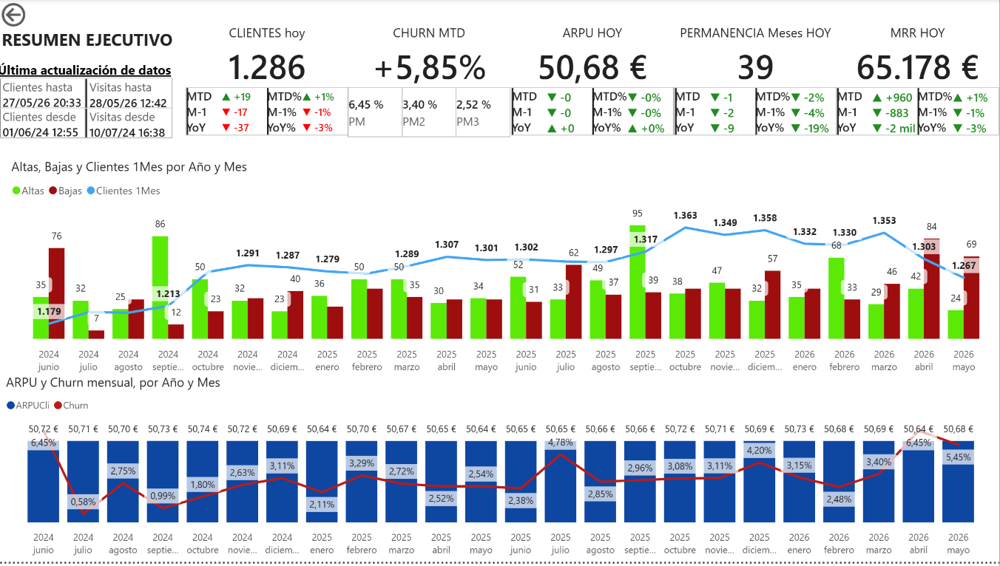

## 2. “Clientes. Caracterización”

Datos demográficos.

### Estructura

Dos franjas.

### Primera franja

Tarjetas de KPIs actuales en grande y debajo la distrubución de segmentos:

* Edad Media
* Sexo
* Membresías Familiares
* Mismo CP (si su domicilio tiene el mismo CP que el centro)
* Permanencia

### Segunda franja

Dos evolutivos para ver tendencias:

1. Evolutivo mensual dos últimos años de segmentos de edad y Edad Media.
2. Evolutivo mensual dos últimos años de:
   * %Sexo femenino,
   * %Mismo CP,
   * Clientes con permanencia de más de 3 años tanto en valor absoluto como relativo.

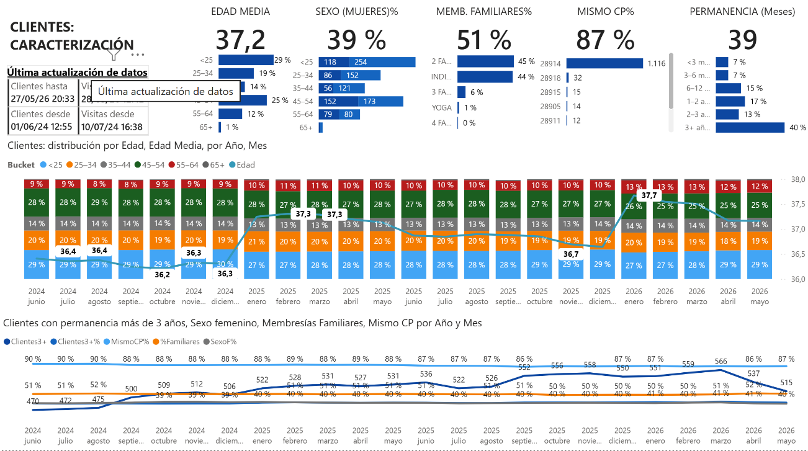

## 3. “Clientes.Visitas.”

Caracterización de las visitas desde la óptica de cliente, no del centro.

### Estructura

Dos franjas.

### Primera franja

Tarjetas de KPIs actuales en grande y comparativos abajo más pequeño.

Los KPIs son:

* Clientes Activos (los que han visitado el centro en el último mes)
* Visitas mes por activo (último mes)
* Duración de la Visita en minutos (último mes)
* Días desde la última visita

Debajo del KPI actual en mayúscula, está debajo más pequeño:

* el valor del mes actual,
* del mes anterior,
* y de ese mes el año pasado.

### Segunda franja

1. Gráfico evolutivo mensual de los últimos dos años del %de clientes activos y su distribución por número de visitas.
2. Gráfico evolutivo mensual últimos dos años de Distribución de Clientes actuales por segmentos de Edad-Sexo, en activos y distribución de número de visitas.

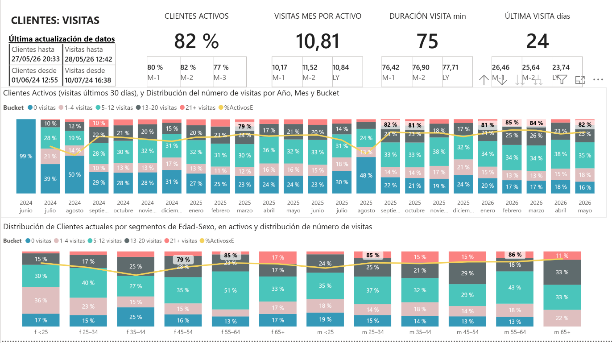

## 4. “Centro. Ocupación. Evolutivo Mensual”

Visitas recibidas, duración, minutos de saturación del centro (concurrencia en el centro de más de 90 personas incluído el cliente).

### Primera franja

Valores actuales de los KPIs y debajo los valores:

* el mes anterior,
* hace dos meses,
* y mismo mes hace un año.

### Segunda franja

Evolutivo mensual de los últimos dos años de:

* Visitas por mes,
* distribución de la ocupación mensual,
* minutos de saturación por mes.

### Segunda Franja

Evolutivo mensual de:

* Visitas de Clientes únicos,
* Duración promedio de visita por cliente,
* Distribución de la Experiencia de Cliente.

La Experiencia de Cliente se realiza en función del porcentaje de minutos de visita del cliente que no existió saturación.

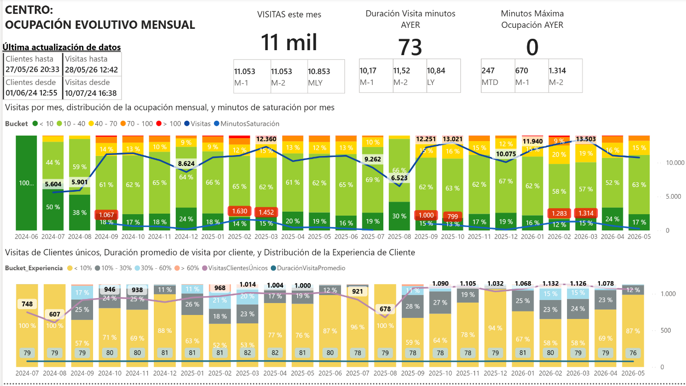

## 5. “Centro. Ocupación. Evolutivo diario”

Idem que el anterior pero diario y de los últimos 30 días.

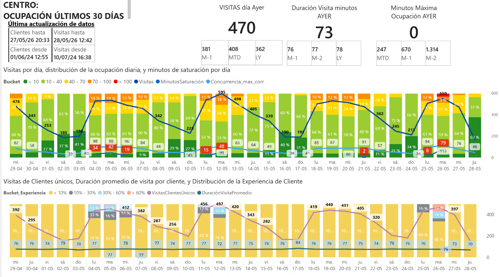

## 6. “Mapa de Calor de Ocupación día-hora”

Concurrencia, Duración Visita, por Día de la Semana, Hora y Segmentadores de:

* Sexo,
* Edad,
* Membresía,
* CP.

Está hecho por heatmap y no curva contínua porque:

* se ve mejor los datos,
* permite colores,
* es más visual,
* y con más datos.

Permite conocer:

* cuántas personas hay en cada hora,
* cuánto dura su visita,
* y emplear segmentadores si se quiere.

Tiene además:

* filas y columnas totales,
* promedios.

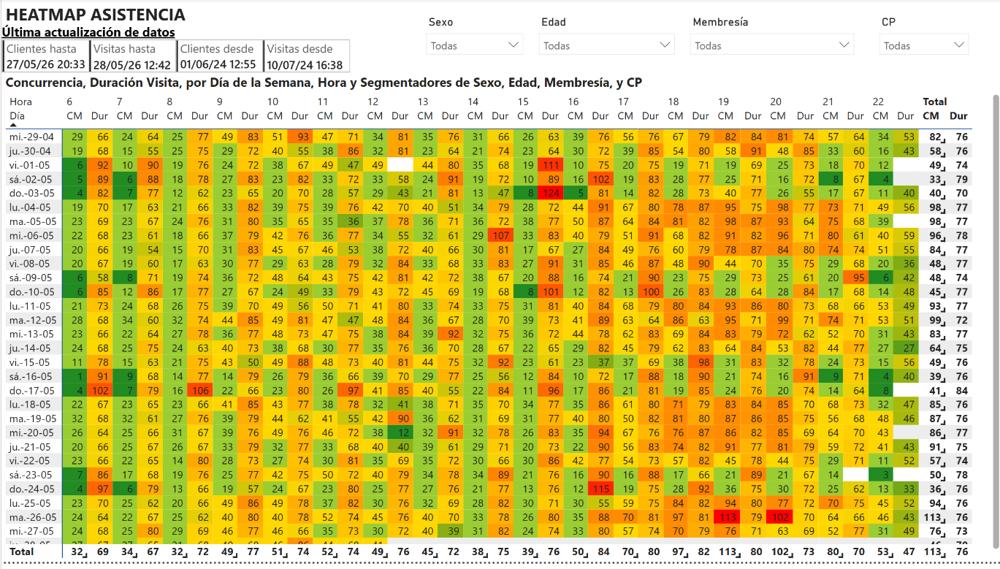

## 7. “Altas. Caracterización”

Datos demográficos.

### Estructura

Dos franjas.

### Primera franja

Tarjetas de KPIs:

#### 1. “Altas hoy”

En grande, debajo en pequeño:

* el mes acumulado,
* los últimos 30 días,
* el mes anterior,
* y el mismo período el año pasado.

#### 2. De las altas en los útimos 30 días

* Edad Media en grande (debajo en pequeño distribución por Sexo)
* Sexo Femenino% en grande (debajo más pequeño la distribución por sexos- franjas de edad)
* Membresías Familiares% (debajo distribución por tipo de Membresía)
* Mismo CP en grande, debajo más pequeño distribución por CP
* ARPU en grande, debajo en pequeño:
  + ARPU acumulado del mes,
  + del mes anterior,
  + y del mismo mes el año pasado.

### Segunda franja

Dos evolutivos para ver tendencias:

1. Evolutivo mensual de las altas en los dos últimos años de segmentos de edad y Edad Media.
2. Evolutivo mensual de altas dos últimos años de:
   * %Sexo femenino,
   * %Mismo CP.

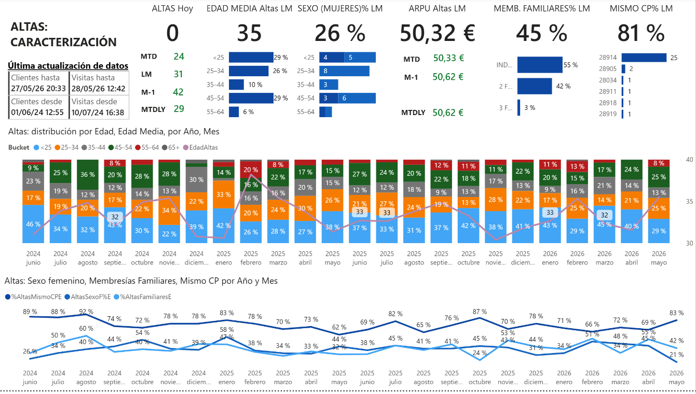

## 8. “Altas. Engagement.”

Visitas de las altas en los primeros 30 días.

### Primera Franja

Mismos KPIs que la página anterior.

### Segunda franja

1. Gráfico evolutivo mensual de los últimos dos años del %de altas activas y su distribución por número de visitas.
2. Grafico evolutivo mensual últimos dos años de Distribución de Clientes actuales por segmentos de Edad-Sexo, en activos y distribución de número de visitas.

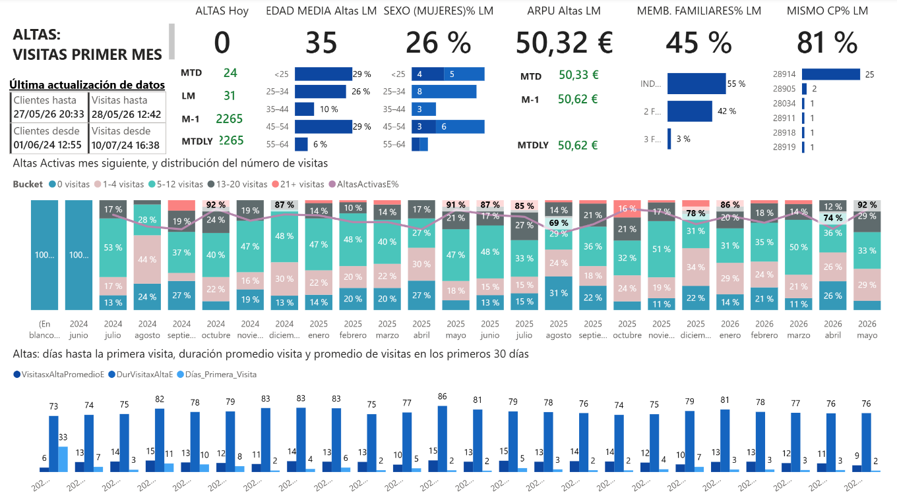

## 9. “Bajas. Caracterización”

Datos demográficos.

### Estructura

Dos franjas.

### Primera franja

Tarjetas de KPIs:

#### 1. “Bajas hoy”

En grande, debajo en pequeño:

* el mes acumulado,
* los últimos 30 días,
* el mes anterior,
* y el mismo período el año pasado.

#### 2. De las bajas en los útimos 30 días

* Edad Media en grande (debajo en pequeño distribución por Sexo)
* Sexo Femenino% en grande (debajo más pequeño la distribución por sexos- franjas de edad)
* Membresías Familiares% (debajo distribución por tipo de Membresía)
* Mismo CP en grande, debajo más pequeño distribución por CP
* ARPU en grande, debajo en pequeño:
  + ARPU acumulado del mes,
  + del mes anterior,
  + y del mismo mes el año pasado.

### Segunda franja

Dos evolutivos para ver tendencias:

1. Evolutivo mensual de las bajas en los dos últimos años de segmentos de edad y Edad Media.
2. Evolutivo mensual de bajas en los dos últimos años de:
   * %Sexo femenino,
   * %Mismo CP.

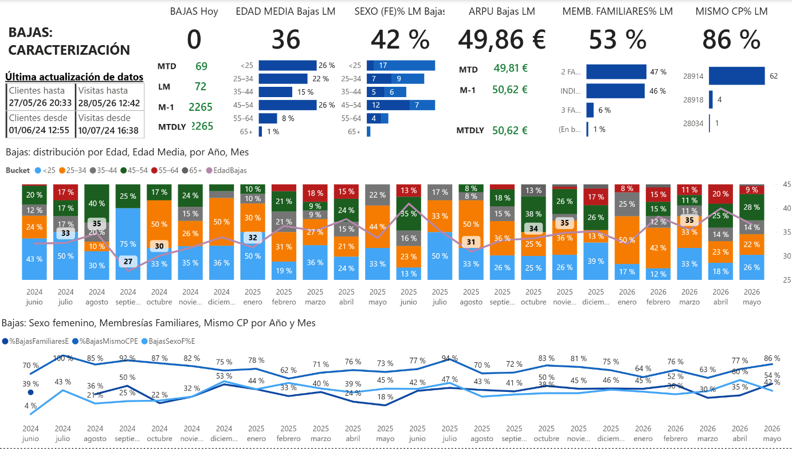

## 10. “Bajas. Engagement.”

Bajas activas y visitas en el último mes.

### Primera Franja

Mismos KPIs que la página anterior.

### Segunda franja

1. Gráfico evolutivo mensual de los últimos dos años del %de bajas activas en el último mes y su distribución por número de visitas.
2. Grafico evolutivo mensual últimos dos años de:
   * promdio días desde la última visita,
   * visitas promedio en el último mes.

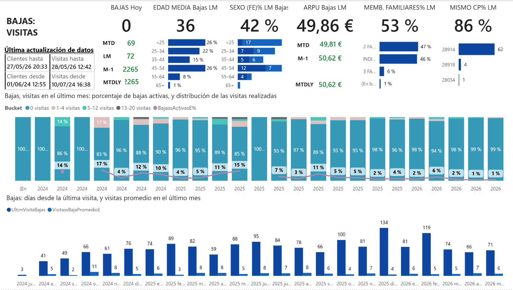

## 11. “Altas. Cohortes”

Agrupación de altas por cohortes mensuales, evolutivo mensual por antigüedad desde el mes 0 (mes del alta) hasta el mes 12, de datos de:

* % de Altas que permanecen como clientes,
* % de altas activas (con visitas ese mes),
* y número de visitas.

Esta primera página es en forma matricial con:

* totales,
* y desglose por mes-año de cohorte

para poder ver patrones y diferencias entre las cohortes.

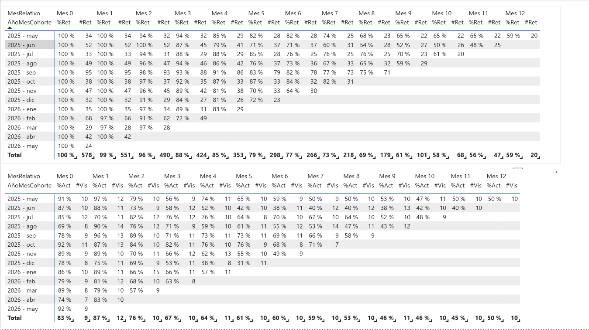

## 12. “Altas. Cohortes. Resumen”

Dos franjas.

### Primera franja

El evolutivo mensual por mes de antiguedad de:

* Altas que se mantienen como clientes
* y de Altas que son activas (visitan el centro).

### Franja de abajo

Es el evolutivo mensual por mes de antigüedad de:

* distribución de las altas por segmentos de experiencia (saturación del centro)
* y duración promedio de la visita en minutos.

Como son gráficos agrupados por antigüedad, se han puesto arriba de la página segmentador por:

* cohorte (mes-año),
* sexo,
* segmento de edad,
* membresía,
* y Código Postal.

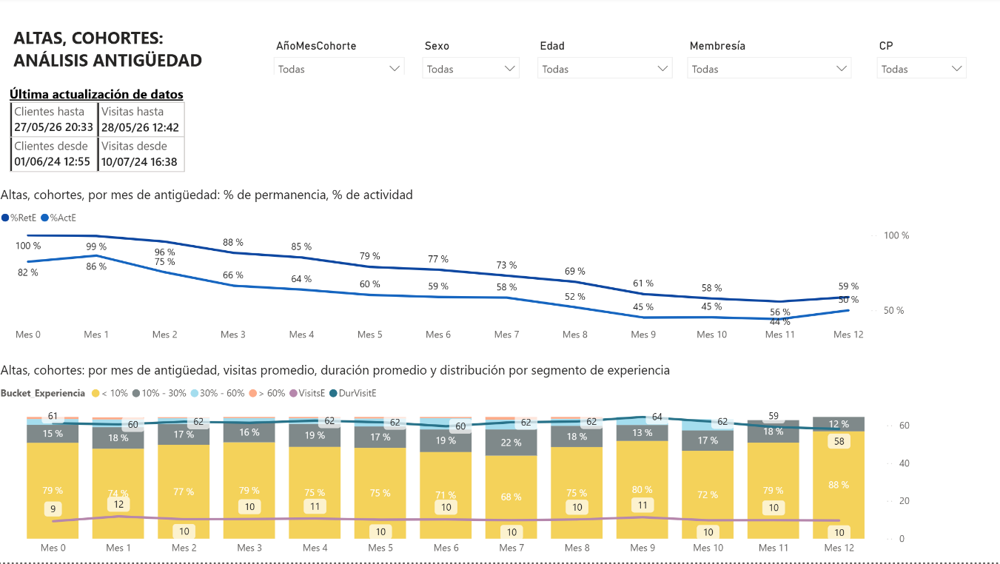

## 13. “Bajas. Cohortes”

Agrupación de bajas por cohortes mensuales, evolutivo mensual por antigüedad inversa desde el mes 0 (mes de la baja) hasta el mes -12, de datos de:

* % de Bajas que permanecen como clientes,
* % de bajas activas (con visitas ese mes),
* y número de visitas.

Esta primera página es en forma matricial con:

* totales
* y desglose por mes-año de cohorte

para poder ver patrones y diferencias entre las cohortes.

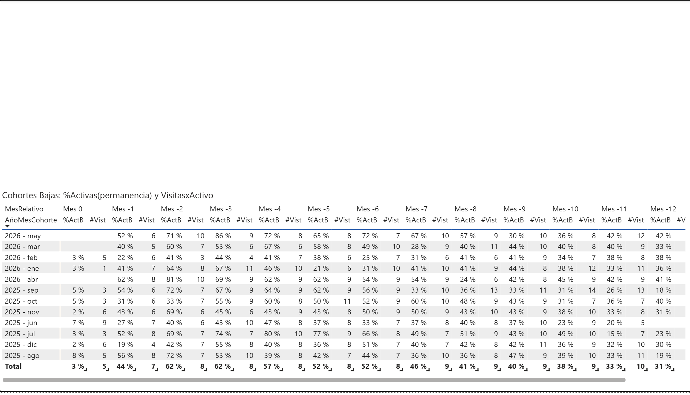

## 14. “Bajas. Cohortes. Resumen”

Dos franjas.

### Primera franja

El evolutivo mensual por mes de antiguedad inversa de:

* bajas que se mantienen como clientes
* y de bajas que son activas (visitan el centro).

### Franja de abajo

Es el evolutivo mensual por mes de antigüedad inversa de:

* distribución de las bajas por segmentos de experiencia (saturación del centro)
* y duración promedio de la visita en minutos.

Como son gráficos agrupados por antigüedad, se han puesto arriba de la página segmentador por:

* cohorte (mes-año),
* sexo,
* segmento de edad,
* membresía,
* y Código Postal.

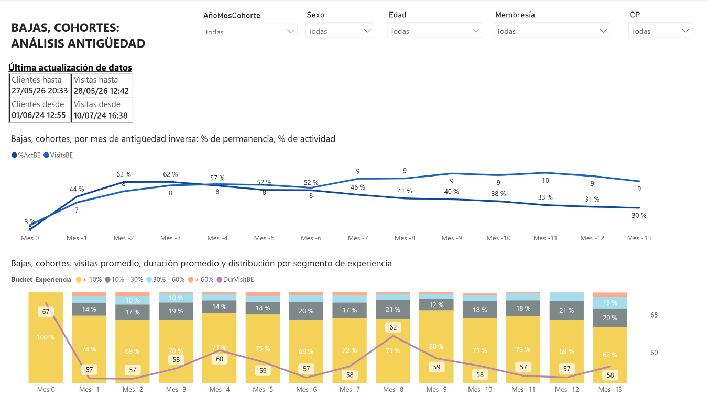

# 🗂️ Estructura del Proyecto

.
├── data/
├── notebooks/
│ └── etl\_proyecto\_final\_python.ipynb
├── dashboards/
├── .env
├── requirements.txt
└── README.md

# ⚙️ Instalación y Requisitos

## Clonar el repositorio

git clone https://github.com/usuario/repositorio.git
cd repositorio

## Crear entorno virtual

python -m venv venv

### Windows

venv\Scripts\activate

### Linux / Mac

source venv/bin/activate

## Instalar dependencias

pip install -r requirements.txt

## Configurar variables de entorno

CLUB\_SECRET=tu\_club\_secret
API\_KEY=tu\_api\_key

## Ejecutar notebook

jupyter notebook

# 📊 Resultados y Conclusiones

El proyecto permitió obtener una visión completa del comportamiento de clientes y operaciones del gimnasio.

Entre los principales resultados destacan:

* análisis histórico de clientes,
* evolución temporal de altas y bajas,
* patrones de asistencia,
* análisis de ocupación,
* cohortes de retención,
* análisis operativo del gimnasio.

La combinación entre ETL en Python y modelado analítico en Power BI permitió separar correctamente:

* procesamiento de datos,
* lógica analítica,
* visualización,
* cálculos dinámicos mediante DAX.

# 🔄 Próximos Pasos

* Dashboard en tiempo real totalmente automatizado: ejecución en la nube, migración del almacenamiento en base de datos, implementación del tiempo real o bajo demanda
* Modelos predictivos de churn.
* Segmentación avanzada.
* Forecasting de ocupación.

# ✒️ Autor

Antonio Fernández Borondo

Proyecto Final — Análisis de Datos, ETL y Business Intelligence

GitHub: <https://github.com/afborondo>/